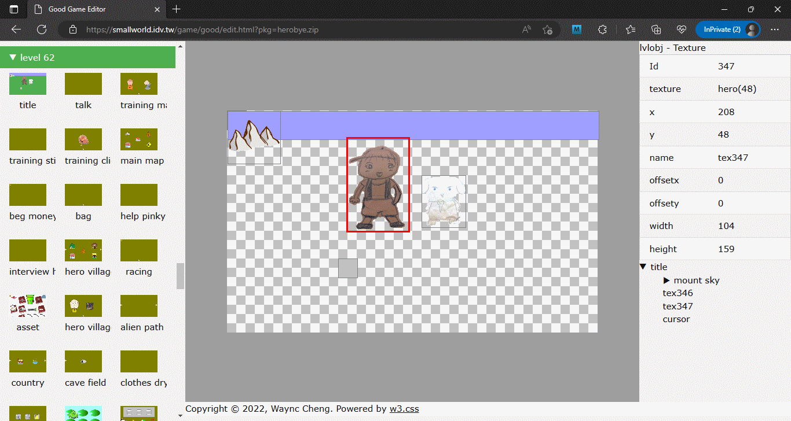
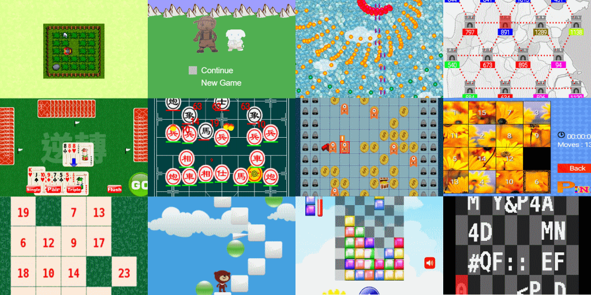

# Cross platform 2D game editor/player

* Windows editor and Android APK download https://github.com/cnyaw/goodbin
* Blog https://good-ed.blogspot.com/
* API Reference https://agile-hollows-18660.herokuapp.com/good-ed/goodapi.html
* Play some games online https://agile-hollows-18660.herokuapp.com
* HTML5 resource browser (WIP) https://agile-hollows-18660.herokuapp.com/game/good/good.php

WIN32 Editor

HTML5 Editor

Some Games Made By GoodEd

# Resource Editors
* Texture Viewer
* Map Editor
* Sprite Editor
* Level Editor
* Particle Viewer

# Graphics
* Support Formats: BMP/JPG/PNG
* Scale
* Rotate
* Alpha
* Scale/Rotate Anchor
* Dynamic Texture Packing
* Dynamic Sprite Batching
* Render When Dirty
* Software Canvas

# Text
* System Font
* Fixed 5x8 Font
* Bitmap Font
* Anti-Alias

# Audio
* Support Formats: WAV/OGG

# Particle
* STGE (https://github.com/cnyaw/stge)

# Object Hierarchy
* Dummy Object

# Misc
* Misc samples
* Programming Lua (https://www.lua.org/)
* Cross Platform Packages
* Simple Animator

# Platforms
* Microsoft Windows (https://github.com/cnyaw/goodbin/tree/master/latest-build-win32-editor)
* iOS
* Android (https://github.com/cnyaw/goodbin/tree/master/latest-build-android-apk)
* PSP
* MOD
* HTML5 (https://agile-hollows-18660.herokuapp.com)
* ESP32
