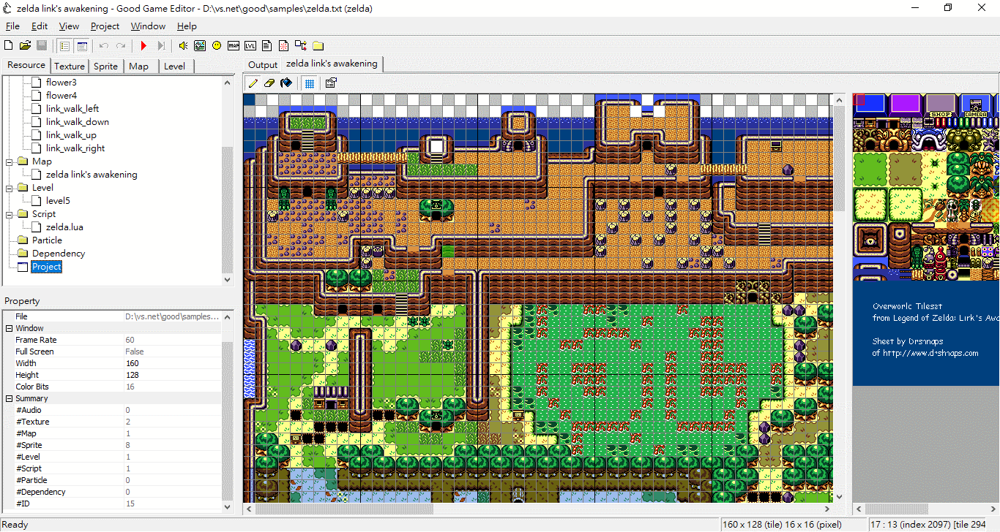

# Cross platform 2D game editor/player

Android player download https://play.google.com/store/apps/details?id=weilican.good  
Blog https://good-ed.blogspot.com/  
API Reference http://good-ed.smallworld.idv.tw/wiki/index.php?title=Good_API_Reference

# Resource Editors
* Audio Viewer
* Texture Viewer
* Map Editor
* Sprite Editor
* Level Editor
* Particle Viewer

# Graphics
* Support Formats: BMP|JPG|PNG
* Scale
* Rotate
* Alpha
* Scale/Rotate Anchor
* Dynamic Texture Packing
* Dynamic Sprite Batching
* Render When Dirty

# Text
* System Font
* Bitmap Font
* Anti-Alias

# Audio
* Support Formats: WAV|OGG

# Particle
* STGE

# Object Hierarchy
* Dummy Object

# Misc
* Misc samples
* Programming Lua
* Cross Platform Packages
* Stand-alone WIN32 EXE
* Simple Animator

# Platforms
* Microsoft Windows
* iPhone/iPod Touch/iPad
* PSP
* Android
* MOD
